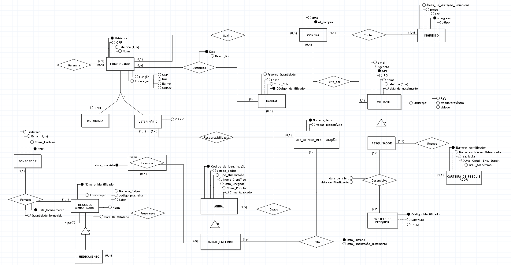
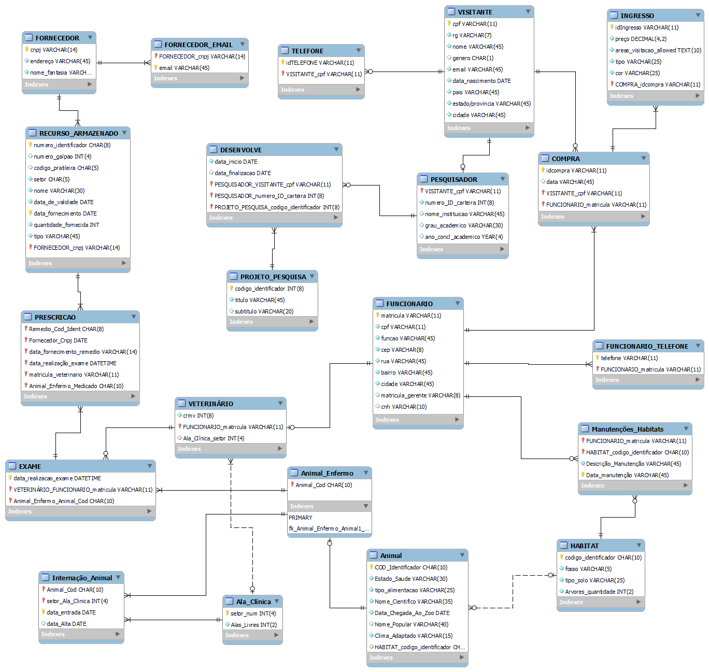

# Parque_Zoobotanico-BD1

## Objetivo
O objetivo deste projeto é a criação de um banco de dados relacional em MySQL, partindo da elaboração do Minimundono intuito da obtenção da nota final da disciplina Banco de Dados I, IFPB - Campus João Pessoa

## Minimundo
O Parque Zoobotânico Arnaldo Calixto César, mais conhecido como Parque Arsar, é o maior zoológico do Brasil e uma das maiores referências de pesquisas científicas em todo o mundo.

O parque possui cerca de cento e cinquenta espécies de animais e trezentas espécies de plantas diferentes! Em um levantamento recente, percebeu-se que o parque recebe de dois mil a quatro mil visitantes diariamente, variando entre cidadãos brasileiros comuns e renomados cientistas estrangeiros. O Parque Arsar é sinônimo de beleza e preservação ambiental, abrigando pesquisadores de diferentes áreas científicas e veterinários que trabalham na reabilitação de milhares de animais mensalmente.

Devido à alta demanda de visitas, projetos de pesquisa e chegada de animais ao parque, o diretor do parque requisitou a construção de um banco de dados a fim de satisfazer suas exigências.

### Exigências
- Para que o parque tenha mais controle sobre os seus visitantes, é necessário cadastrar o nome, a data de nascimento, o endereço (apenas o país, estado/província e cidade), o CPF e RG, um único e-mail e dando como opção: a inserção do gênero, nenhum ou vários números de telefone. 

- Devido ao fato do Zoo receber milhares de visitantes diariamente com diferentes propósitos, eles adotaram três tipos de ingresso: adulto, pesquisador e infantil. Cada tipo possui uma cor e preço diferentes, como também garantem acesso a determinadas áreas do zoológico. Como garantia da individualidade, todos possuem um código identificador. 

- Os animais precisam estar devidamente especificados, a fim de evitar problemas quando forem enviados para um habitat, ou para uma ala de reabilitação. Todos os animais que dão entrada ao zoológico recebem
um código de identificação e deve ser cadastrado qual o dia de sua chegada e seu estado de saúde. Também é necessário cadastrar o nome científico e nome comum (se houver), qual o seu tipo de alimentação (carnívoro, herbívoro, omnívoro, insectívoro e etc.). 

- O Parque Arsar possui uma gama de funcionários, zeladores, biólogos, veterinários e etc. Por conta disso, os funcionários precisam ter cadastrado além do nome, CPF e matrícula, é preciso ter um ou mais número de telefone, o seu endereço (CEP, rua, bairro e cidade) e a sua função. Caso o funcionário seja um veterinário, é preciso cadastrar a sua CRMV e qual a sua especialização e caso seja motorista, é preciso ter cadastrado a sua CNH. 

- Cada habitat possui características propícias para cada espécie de animal, nas quais precisam ser cadastradas: a quantidade de árvores plantadas, se possui ou não um fosso e o tipo de solo (grama, areia, concreto e etc). Eles devem possuir um código de identificação e algo que indique a quantidade de animais nele inseridos. 

- Também é necessário catalogar os alimentos, remédios e equipamentos estocados, buscando saber a data de validade e o seu nome. É preciso também cadastrar onde ele se encontra: o setor, o número do galpão e a prateleira, este dois últimos são opcionais. Cada item deve possuir um número identificador. 

- O zoológico também gostaria de obter informações dos responsáveis por fornecer os alimentos e recursos para manutenção do parque, como: o nome fantasia, CNPJ, um ou vários e-mails e o endereço. 

- Voltando para a questão dos animais, o parque Arsar gostaria de cadastrar, caso o animal esteja enfermo, os resultados dos exames realizados com tal bicho. Também deve ser cadastrado a data do ocorrido, o veterinário responsável e o medicamento prescrito (se houver). 

- O parque é referência de pesquisas científicas e precisa ter o controle das pesquisas que estão sendo realizadas no seu âmbito. Ela exige as seguintes informações: o nome, CPF e email dos pesquisadores envolvidos, a data de início do projeto, data de finalização, o título e subtítulo (se houver) e um código que sirva de identificação. Todo pesquisador é um visitante.

- Quando o visitante compra os ingressos, ele precisa informar a quantidade, a data na qual o visitante deseja realizar a visita e o tipo de ingresso que ele deseja adquirir. A fim de melhor visualização do período mais desejado para compra de ingressos, o parque gostaria que a data inserida no cadastro fosse composta em: dia, mês e ano. 

- Todos os recursos ( alimentos / equipamentos/ medicamentos) são entregues por um ou vários fornecedores. É preciso cadastrar a data e a quantidade que foi entregue. 

- No meio dos funcionários, há chefes de departamentos e o próprio diretor. Eles são responsáveis por gerenciar equipes de funcionários. Vale ressaltar que não existe ninguém acima do diretor. 

- O ingresso pode ser ou físico ou digital. O ingresso físico é adquirido pelo visitante a partir da bilheteria e o digital é comprado pelo site oficial. Caso o visitante opte pelo modelo físico, é preciso cadastrar qual o funcionário que executou a compra. Entretanto, a compra do modelo digital requer apenas as informações do visitante. Nos dois casos é preciso saber a data e hora da efetivação da compra e a quantidade pedida. Um visitante pode comprar zero ou vários ingressos dos dois tipos e este só pode ser comprado por um único visitante. 

- Os pesquisadores são geralmente estudantes, mestres, doutores, bacharéis ou pessoas sem nenhuma formação acadêmica. Para que possam ser identificados com mais facilidade, todos devem possuir a carteirinha do pesquisador na qual é fornecida pelo zoológico. Toda carteira possui um número de oito dígitos como identificador e apresenta todos os dados de seu possuinte com o acréscimo do nome 
da instituição que ele está agregado, o número da matrícula, o ano de conclusão do ensino superior e o seu grau acadêmico. 

- Dependendo da saúde do animal, ele poderá ser destinado a um habitat. Ou seja todo animal poderá ou não ser destinado para um habitat, enquanto um habitat poderá receber nenhum ou vários animais. 

- Os animais doentes, dependendo da situação em que se encontram, poderão ser encaminhados para uma ala do centro de reabilitação. Caso seja necessário interná-lo, será preciso cadastrar o dia em que eles deram entrada na clínica e o dia em que foram devolvidos para a natureza.

## Modelo entidade relacionamento (DER)

## Modelo Logico

## Notas Finais

- Estamos abertos a qualquer dúvidas, comentários e conselhos 😊